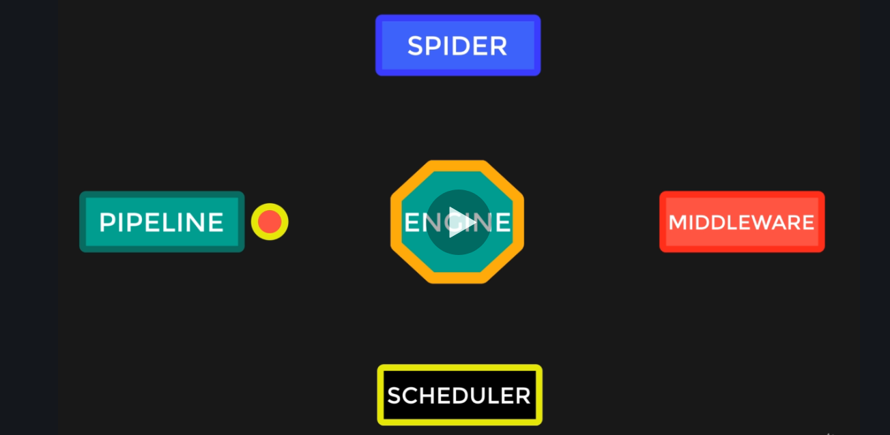

# Scrapy
## Scrapy components:
    - spiders
    - pipelines - piping actions on scraped data
    - middlewares - request / response, injecting custom headers, proxying
    - engine - ensures consistency between all operations that happen
    - scheduler - preserving the order of operations (FIFO)

## Spider classes:
    - scrapy.Spider
    - CrawlSpider
    - XMLFeedSpider
    - CSVFeedSpider
    - SitemapSpider

Engine is the connector for everything. When new request is added it is delegated from the engine to the scheduler queue, when it is in line for execution it is passed to the engine and then to the middleware which executes the request. Response is passed to the engine and then to the spider to handle the response and extract data. Extracted data is then sent to the ending which passes it to the pipeline to process the data.

## Shell
Scrapy shell is started by entering:
`scrapy shell [url]`

If we can manually fetch target website witch command:
`fetch(url)` or `r = scrapy.Request(url)`

Then we can checkout the output by typing
`response.body`

We can preview this in browser by typing
`view(response)`

We can use xpath to get elements:
`title = response.xpath("//h1/text()")`
and then `title.get()` and response will be: 'Countries in the world by population (2020)'

We can also use css to get elements:
`countries = response.css("td a::text").getall()`

## CSS selectors
https://try.jsoup.org/
Examples:

`.some_class` to get all HTML elements with class some_class

`#some_id` to get HTML element with id some_id

`div.some_class` to get all div elements with class some_class

`.bold.italic` to get elements that have n classes (2 in this example)

`li[data-identifier=7]` to get element of specific type with specific atr value more: `a[href^='https']` here is an example for starts with. Ends with: `a[href$='fr/']`, example for in the middle: `a[href*='ps']`

`div.intro p` to get all p's into div with class intro without children, for all the children: `div.intro > p`, to get p immidietly after: `div.intro + p`

`li:nth-child(odd)` get all odd indexed li items

`div ~ p` get all ps that are on some level under div

## XPath fundamentals
`//div[@class='intro']/p` get p's from divs with class intro.

`//div[@class='intro' or @class='outro' ]/p` get p's from divs with class intro or outro

`//div[@class='intro' or @class='outro' ]/p/text()` like previous but get only values

`//a[starts-with(@href, 'https')]` select a elements where href start with https, there is also `ends-with` and `contains` function.

`//a[contains(text(), 'France')]` there we used text instead of atribute name.

`//ul[@id='items']/li[position() = 4 or position() = 1]` get li from ul with id 'items', get li items with indexes 1 and 4 if they exisit. `//ul[@id='items']/li[position() = 4 or position() = last()]`

`//ul[@id='items']/li[position() > 2]` get elements on indexes greater than 2

`//p[@id='unique']/parent::node()` get parent of the element with id. We can also use ancestor instead of parent or ancestor-or-self or preceding. Preceding is the element on the same depth. We can also use preceding-sibling which will return brother preceding element.

`//div[@class='intro']/child::node()` get all children of div element with class intro. We can use following instead of child or following-sibling or descendant.

## Scraping
To start a project use the command: `scrapy startproject proj_name`

than `cd proj_name`

than to create a spider: `scrapy genspider spider_name`

To output the results in a file:
`scrapy crawl crawler_name output_file.[json | csv | xml]`

In settings.py we can set export encoding:
`FEED_EXPORT_ENCODING = 'utf-8'` by adding this line at the end of the file

## Spoofing requests
In settings.py we can set user agent for a real browser:
`USER_AGENT = 'Mozilla/5.0 (X11; Ubuntu; Linux x86_64; rv:74.0) Gecko/20100101 Firefox/74.0'`

We can edit mutiple values in header by overwritting `DEFAULT_REQUEST_HEADER` in settings.py
We can also create start_request method.

## Debuging
We can call a spider's method from terminal to check its output

`scrapy parse --spider=countries -c parse_country --meta='{"country_name": "China"}' "https://www.worldometers.info/world-population/china-population"`

We can open scrapy shell in the middle of the execution by importing `from scrapy.shell import inspect_response`
and adding this line: `inspect_response(response, self)`

We can open in browser by importing: `from scrapy.utils.response import open_in_browser`
and adding this line: `open_in_browser(response)`

We can log different thigs by importing `import logging` and adding line:
`logging.info(something)`

We can also debug with brakepoints, in order to achieve that, we need to create runner python file. Take a look at runner.py in gassesshop. From vs code debug that file as a python file and add brakepoints before starting the file.

## CrawlSpider
Generation command: `scrapy genspider -t crawl best_movies imdb.com`

Rules:
`rules = (
        # Extract links matching 'category.php' (but not matching 'subsection.php')

        # and follow links from them (since no callback means follow=True by default).
        Rule(LinkExtractor(allow=('category\.php', ), deny=('subsection\.php', ))),

        # Extract links matching 'item.php' and parse them with the spider's method parse_item
        Rule(LinkExtractor(allow=('item\.php', )), callback='parse_item'),
    )
`

## Splash

Install docker image:

`sudo docker pull scrapinghub/splash`

Run docker image:

`sudo docker run -it -p 8050:8050 scrapinghub/splash`

To use splash in scrapy, create a project and a spider, and in spider settings.py add:

`SPLASH_URL = "http://localhost:8050/"`

Next, add download middleware for splash:

`DOWNLOADER_MIDDLEWARES = {
    'scrapy_splash.SplashCookiesMiddleware': 723,
    'scrapy_splash.SplashMiddleware': 725,
    'scrapy.downloadermiddlewares.httpcompression.HttpCompressionMiddleware': 810,
}
`

Next, add spider middleware:

`SPIDER_MIDDLEWARES = {
    'scrapy_splash.SplashDeduplicateArgsMiddleware': 100,
}
`

And lastly:

`DUPEFILTER_CLASS = 'scrapy_splash.SplashAwareDupeFilter'`
